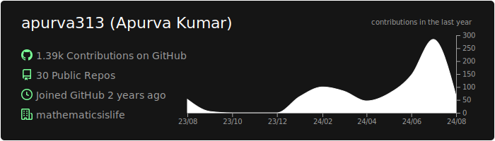
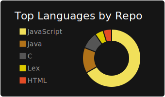
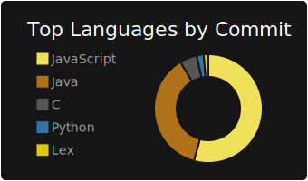
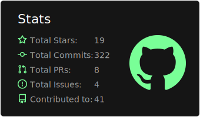
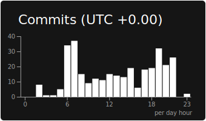

## dark

[](https://github.com/apurva313/apurva313)
[](https://github.com/apurva313/apurva313) [](https://github.com/apurva313/apurva313)
[](https://github.com/apurva313/apurva313) [](https://github.com/apurva313/apurva313)
### Now you can add this to your markdown
```

[](https://github.com/apurva313/apurva313)
[](https://github.com/apurva313/apurva313) [](https://github.com/apurva313/apurva313)
[](https://github.com/apurva313/apurva313) [](https://github.com/apurva313/apurva313)

```

### Each card usage
---


```

```

    

---


```

```

    

---


```

```

    

---


```

```

    

---


```

```

    
